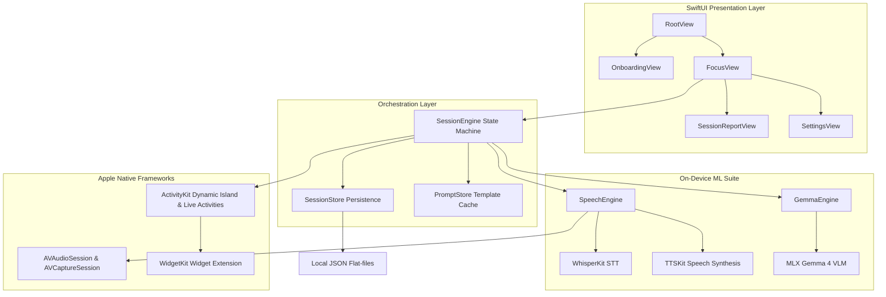
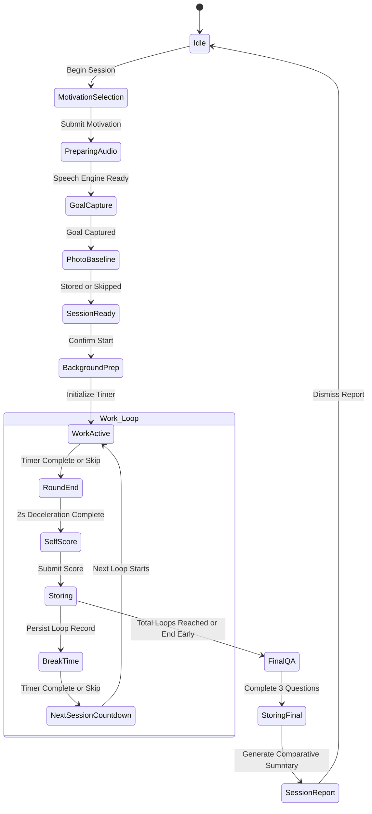

# Tallyvity

Tallyvity is a native iOS voice-driven Pomodoro and self-reflection companion. It leverages on-device speech-to-text, text-to-speech, and vision-language models to structure focus sessions, support progress tracking, and facilitate objective self-assessment. By relying entirely on local processing, the application guarantees user privacy and operates completely offline.

---

## Technical Architecture

The application is structured into four main layers: the SwiftUI Presentation Layer, the Orchestration Layer, the On-Device Machine Learning Suite, and Apple Native OS Integrations. The following diagrams illustrate the core architectural relationships and the session state machine lifecycle.

### Core Component Relationships

### Session State Machine Lifecycle

---

## Architectural Breakdown

### UI Presentation Layer
The SwiftUI Presentation Layer manages user interactions through clean, minimalist interfaces. The entry point of the app is RootView, which evaluates whether the user has completed onboarding. OnboardingView coordinates the initialization of models, downloading required speech packages, and capturing the user name. Once onboarding is complete, FocusView handles the primary workspace, loading rotary time pickers, timer rings, self-evaluation controls, and visual media capture overlays. SettingsView provides toggles for model sizes, speech voices, and diagnostic panels.

### Orchestration Layer
SessionEngine serves as the central state machine. It manages transitions between work, break, self-scoring, and recording phases. To ensure resilience against unexpected app terminations, SessionEngine writes serialization checkpoints to active_session_checkpoint.json. SessionStore handles the persistent recording of completed sessions inside an artifacts directory, and it provides search utilities for previous accomplishments. PromptStore loads a structured JSON file at boot, caching dynamic voice cues, localization settings, and default UI labels.

### On-Device Machine Learning Suite
Local inference forms the foundation of Tallyvity. SpeechEngine controls WhisperKit to transcribe spoken goals or question responses. It configures the AVAudioSession for simultaneous recording and playback, receiving mono audio streams at 16 kHz to match Whisper's native expectations. The engine also drives TTSKit to synthesize responses using custom speech profiles. GemmaEngine loads the Gemma 4 vision-language model using Apple MLX to read context-aware prompts. During work phases, Gemma compiles session data in the background to output comparative descriptions of workspace changes and compile final session artifacts.

### Apple Native Integrations
AVFoundation is used to capture photos at baseline and round-end, and to handle real-time metering for silence detection. ActivityKit manages the lifecycle of lock screen widgets and Dynamic Island displays, ensuring that live session timers survive background suspension. WidgetKit acts as the rendering boundary, drawing updates from TallyvityAttributes and maintaining the monospaced timer presentation on system bezels.

---

## Cognitive and Behavioral Design

### Production and Accountability Cues
At the beginning of a session, users verbally state their focus goals. This voice-first contract uses the cognitive production effect to reinforce intention. In parallel, the app prompts for an optional workspace photo. Rather than using gamified rewards, Tallyvity creates accountability through physical evidence. If the user captures photos at the start and end of a session, Gemma generates a factual observation of visible changes. If no changes are detected, the system remains silent to avoid hallucinating judgments.

### Metacognitive Review and Score Anchoring
Every focus round is followed by a structured three-question review covering completion, friction, and next steps. These questions play after a deterministic two-second buffer to allow users a brief cognitive reset after intense work. To avoid subjective evaluation bias, the self-scoring interface maps completion scores to concrete behavioral anchors rather than emotional labels. A score of one means the task was not started, whereas a score of five indicates the task was successfully completed or exceeded.

### Adaptive Flow and Cognitive Rest
If a user indicates low starting motivation, defined as a score of two or lower, the engine shifts to a low-commitment five-minute starter block. This aligns with behavioral activation principles to lower the barrier to entry. At the end of the five-minute block, a simple yes or no prompt asks the user whether to transition to a full focus block. When breaks occur, FocusView displays a slow, desaturated ambient gradient. This visual pattern minimizes cognitive stimulation and promotes attention restoration by discouraging screen interaction.

---

## Core System Operations

### Audio Recording and Speech Processing
AVAudioRecorder receives incoming audio at a 16 kHz sample rate. While recording, SpeechEngine samples average power levels via hardware-level metering. If the linear loudness level remains below a calibrated floor of 0.04 for more than 2.5 seconds, the engine triggers an automatic stop. This auto-stop mechanism prevents the system from capturing long silences or ambient noise, ensuring higher transcription accuracy when passing the audio payload to WhisperKit. TTSKit then consumes textual responses frame-by-frame, streaming audio directly to the speaker with minimal buffering.

### Semantic Memory Retrieval
When a user declares a new focus goal, Tallyvity uses a custom retrieval pipeline in SessionStore to search past history. Instead of relying on exact word matches, the store decomposes the current goal and past goals into character trigrams. It then calculates the cosine similarity between these frequency vectors. If a past session yields a similarity score above 0.18, Gemma is given the matching historical data to generate a memory recall prompt, reminding the user of prior blockers or next steps at the start of their new session.

---

## Project Structure

* **tallyvity/**: Contains the main iOS application target. This includes views like FocusView and RootView, state orchestrators like SessionEngine, storage pipelines like SessionStore, and on-device machine learning managers like SpeechEngine and GemmaEngine.
* **TallyvityWidget/**: Contains the lock screen widget extension, Dynamic Island presentation configurations, and the WidgetBundle entry point.
* **voice_prompt_generator/**: A Python-based developer utility. It includes worker.py and main.py to compile text-to-speech cues using custom speech embeddings, saving compressed M4A assets for inclusion in the app bundle.
* **docs/**: Houses technical guides for model integration, Whisper configurations, and Silero VAD compilation steps.
* **specs/**: Contains engineering spec files and master implementation trackers mapping the progress of system checkpoints.
* **audio_production/**: Contains Ableton Live session templates used to master fixed audio cue assets.

---

## Developer Setup

Building Tallyvity requires macOS 14.0 or later, Xcode 16.0 or later, and a device or simulator running iOS 18.0 or later. 

To build the application, open tallyvity.xcodeproj in Xcode. The project resolves native Swift package manager dependencies, including Apple MLX, Swift Transformers, HuggingFace, and the Argmax open-source SDK. On first run, the app performs a one-time download of approximately 820 MB of cached files to initialize the WhisperKit and TTSKit models. The 3.6 GB Gemma 4 vision-language model can be downloaded separately using the Diagnostics section in the app settings panel. Run-time diagnostics can be tested using the built-in LLM chat and voice loop views in the settings menu.
